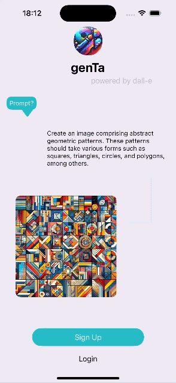
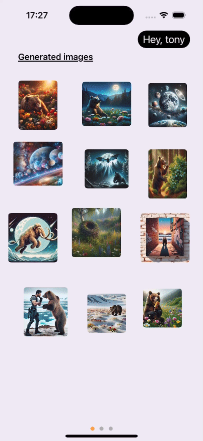
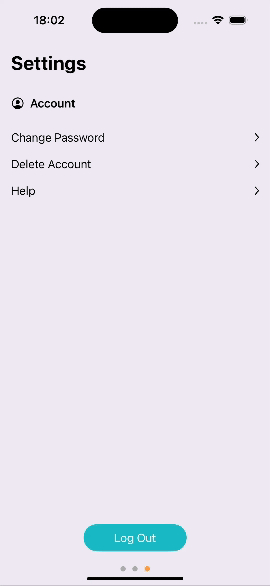

# An IOS app that lets users generate their own images using the chatgpt API

> This is app is my portfolio for swifttUI

#### Languages used: Swift (frontend) | Javascript (backend) Mongoose ExpressJs nodeJs
Im using MVVM architecture for swift, and coreData to store objects, I tried the new SwiftData but that seems only appropriate for an array of objects and doesnt work well for MVVM
#### Tools used: AWS's S3-buckets and EC2, MongoDB


This app allows its users to generate 15 free images every week and after that they can pay per image with a third party provider. Users can register which will need to be authenticated their emails, login reset password by email MFA, generate images, delete account, and more. The images generated are saved on database, which users can access anytime.


## App 
<table>
    <thead>
        <tr>
            <th><h5 style="text-align: center;">Register</h5></th>
            <th><h5 style="text-align: center;">Generate image</h5></th>
            <th><h5 style="text-align: center;">All generated images</h5></th>
            <th><h5 style="text-align: center;">Contact Us</h5></th>
        </tr>
    </thead>
    <tr>
        <td>
        </td>
        <td></td>
        <td></td>
        <td></td>
    </tr>
</table>
 

Issues with app:

1. I did not take great care for storing large images in coreData, this might be an issue if the user is storing many images, the user can only store 15 at most images for this app.

App data:

```json
{
    "user": {
        "email": "",
        "password": "",
        "first_name": "",
        "last_name": "",
        "age": "",
        "generated_imgs": [
            {
                "img_id": "UUID, #key used to get presigned url for user to be able to access the image",
                "prompt": " either gpt revised use REVISED:%j&# | or its just string"
            }
        ]
    },
    "app_run_time": {
        "easy_shutdown": "When the client boots up app, checking if the backend can be reached before doing anything. This way if in the future I can easily shut everything down",
        "Sessions": "JWT tokens and presigned s3 buckets lasts 3 hours"
    },
    "products-used-for-deployment": {
        "Ec2": "backend server is hosted on Amazon EC2",
        "Godaddy": {
            "purpose": "the domain is registered with Godaddy",
            "domain": "genta-ios.app"
        }
    }
}
```